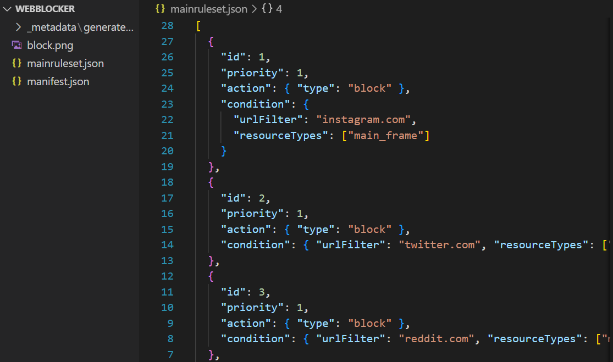

# WebBlockerChromeExtension

This extension is designed to block websites, offering a simple solution to help you stay focused while browsing the web.

## Motivation

I created this extension because simply disabling JavaScript and images from certain websites wasn't enough to keep me away from them. While there are other extensions available, some of them come with a price tag, and I do not believe on paying for something I can easily build myself.

## How to Use

If you'd like to use this extension, follow these simple steps:

1. Open `mainruleset.json`.

2. To remove websites from the blocked list, simply delete the corresponding JSON object that contains the URL.

3. Alternatively, you can change the `urlFilter` property to the URL of the website you wish to block.

4. To add more websites to the block list, duplicate the object, increment the `id` property, and change the `urlFilter` property.

5. Once you've made your desired changes, load the extension into any Chromium-based browser (e.g., Brave, Chrome).

Enjoy distraction-free browsing!

## Note to user

The primary purpose of this extension is to increase the inaccessibility of distractions. Therefore, I intentionally designed it to make the addition and removal of blocked websites challenging. As mentioned in the motivation section, merely disabling and enabling JavaScript and images for certain websites was too effortless, making it more likely for users to revert their choices. The concept here is to introduce friction, as the more friction there is, the less likely an action is to occur. The deliberate difficulty in adding and removing blocked websites is an integral part of this friction mechanism.
